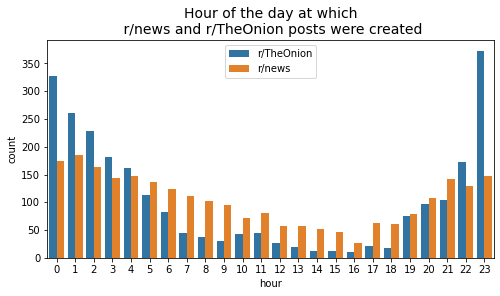
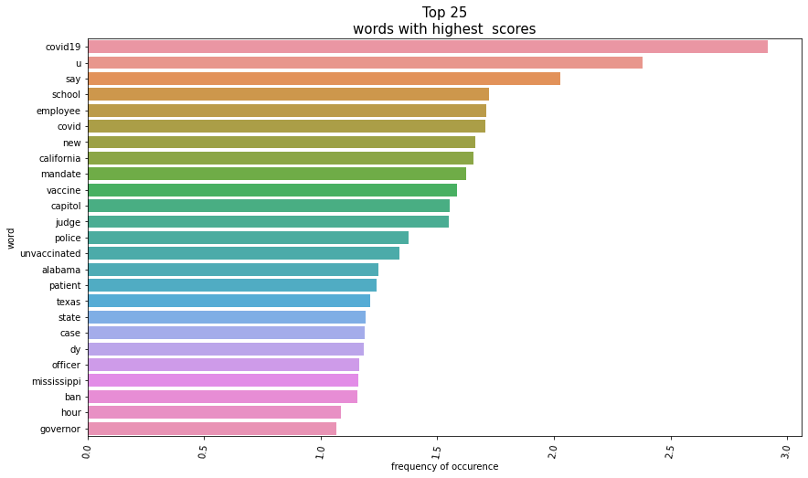
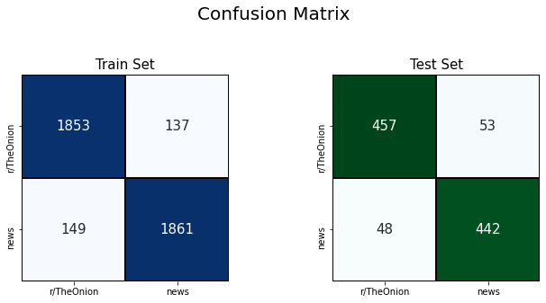
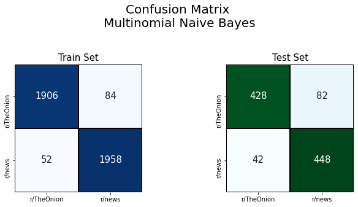
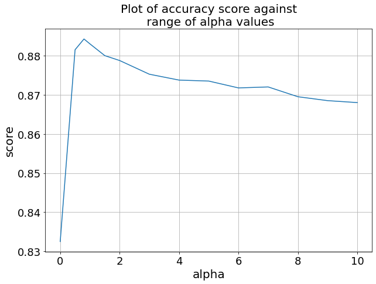

#  Project 3: Web APIs & NLP

# Introduction:
Have you ever fell victim to misinformation? Or worse, forwarded news articles only to realise that they were all false information? Fake news have been on the rise in recent times, in fact it has been shown that 90 per cent of Singaporeans did not spot fake news correctly eventhought 80% were confident of doing so [source](https://www.straitstimes.com/singapore/4-in-5-singaporeans-confident-in-spotting-fake-news-but-90-per-cent-wrong-when-put-to-the). This proves that the human mind is alot more subjective when interpreting news, and therefore the used of machines to learn the intricacies of words in news can be helpful.
- This culminated locally in Singapore where there were fake news being spread about the use of ivermectin as an alternate to covid vaccines [source](https://www.sgh.com.sg/news/covid19/dubious-sources-cited-by-supporters-of-use-of-ivermectin-for-covid-19). Here, the consequence can be drastic and dangerous.
- Fake news are usually generated and gets traction from social media platforms, one of the popular ones being Reddit. Furthermore, fake news arguably captures the reader's attention better than real ones. With social media being the main source of information for most people, it is also the main source for misinformation. If there is ever a time to stomp out fake news, it is now.

# Solution
- In this project, we propose 2 machine learning models that discern fake news from real ones, with a high degree of accuracy.
- The first approach utilizes non-textual data (e.g. post scores, time created, number of comments) to distinguish between fake and real news. This will be considered our baseline model.
- The second approach utilizes Natural Language Processing (NLP) to learn from the words used in reddit posts and to determine if it is fake or real news.

# Exploratory Data Analysis (EDA)
- Our data was web-scraped using the PushShift API and 10,000 documents were extracted from r/TheOnion and r/news subreddits.
- The data was then cleaned and analysed.

Interestingly, we see that r/news posts are created more consistently throughout the day. r/TheOnion posts are more erratic, mostly created at night till the wee hours between 8pm to 2am.
- between 10pm-4am, more r/TheOnion posts were created.
- between 5am-9pm, more r/news posts were created.

After some cleaning of text, we also observe the following frequency of words in our datasets. It seems that covid, school, employee seems to be the dominating words.

# Model Evaluation
- Using non-textual data our baseline mode performed considerably well as shown in the confusion matrix below. It had a high accuracy of 0.91 on unseen test data.

- Using textual data, our NLP-based model peformed well too with an accuracy of 0.89.

For our use case of detecting fake news, we want to maximise the metric `specificity`.
- we want to maximise the number of True Negative (i.e. correctly detecting fake news as fake)
- we want to minimise the number of False Positive (i.e. wrongly detecting fake news as real)

Therefore, from the above confusion matrix perspective, we want to:
- increase the top left number
- decrease the bottom left number

From the looks of it, our model is doing very well in this regards, achieving specificity of 0.899 on the test set. This means, for every 1000 fake news, our model will correctly detect 899 of it as fake.

**Specificity score comparison:**
- Multinomial Naive Bayes: 0.899
- Logistic Regression: 0.866
- KNN :0.905

While the specificity score of KNN is highest, it does not do well in other metric scores. Therefore, the best compromise score is F1-score, in which our model again does very well with 0.894.

**F1-score comparison:**
- Multinomial Naive Bayes: 0.894
- Logistic Regression: 0.885
- KNN :0.808

We also did hyperparameter tuning and below is a graph of how alpha affects the accuracy score for our Multinomial Naive Bayes Model.

# Evaluation and Conclusion
In conclusion, our chosen model is the Multinomial Naive Bayes with TF-IDF vectorizor. The model can be considered a success as it achieves a high accuracy of 0.89. Eventhough the score is just slightly lower than our baseline model, its versatility and the limitations of the baseline model means that our eventual model will always be preferred. With more data to learn from, and from other sources as well, there is potential for even higher scores with this model.

# Recommendation and Future Improvements
One way of improving the project could be to combine both approaches into 1. With more time in hand, ColumnTransformers can be used within Pipeline to determine the scores when textual data is combined with non-textual data.

Also, words used in social media is ever-changing. One word can emerge with an entirely different meaning from normal usage. Including sentiment analysis this project could be useful in making the model more robust.

Furthermore, our model should expand its horizon and accept texts from a variety of sources; either from other subreddits, or even beyond reddit itself.
